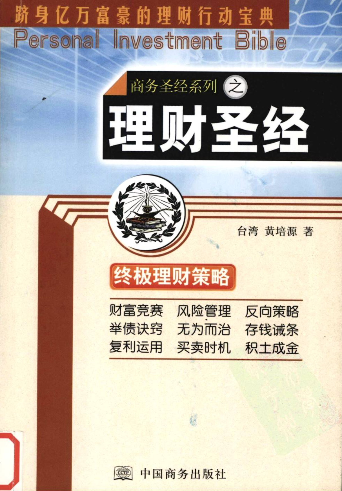

这是一本2004年出版的书，距今近20年，但其中提及的理财知识如今看来却毫不过时，作者从多年投资经验中提炼的真知灼见，深入浅出地传授"大道至简"的投资哲学，书名称为《理财圣经》一点都不为过。
读完这本书后，只感觉相见恨晚，但庆幸还为时未晚。网上只找到了并不清晰的扫描版本，现整理为文字版分享。

> 许多人汲汲营营想赚钱，却不得其门而入; 许多人具备致富条件，但昧于理财以到错失良机，更甚者，因投资错误而倾家荡产。本书作者融合实战经验与丰富学理，钻研十二则理财铁律，助你"乐在理财，轻松致富"，从容跻身亿万富翁之列。
>

### 作者简介

**黄培源**(台湾)
美国柏克莱加大企业管理博士  
 
**历任:**

- 东海大学企业管理研究所 所长  
- 中华开发信托公司专案事业处副处长  
- 美国东西证券公司(East West Securities)副总栽  
- 美国美林证券公司(Merrill Lynch) 投资管理师  
- 多家企业财务顾问
- 三采建设实业股份有限公司 总经理 

